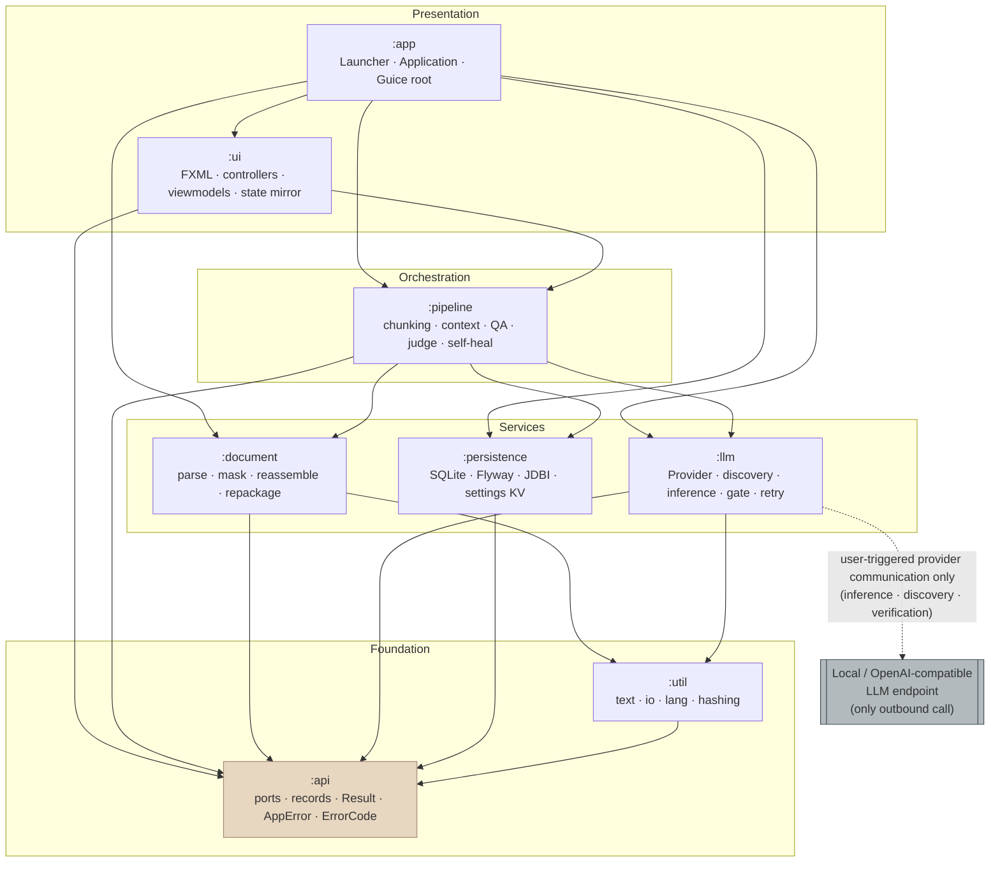

**Status:** Final **Owner:** architect **Audience:** architect, coder, tester, reviewer **Last Updated:** 2026-07-18
**Cross-references:** `docs/specification/02_Architecture/02_MODULES_AND_LAYERING.md`,
`docs/specification/02_Architecture/03_DOCUMENT_MODEL.md`, `docs/specification/02_Architecture/05_PIPELINE_ENGINE.md`,
`docs/specification/03_NonFunctional/03_PRIVACY_AND_OFFLINE.md`

# System Architecture

BookLoom is a local-first, offline desktop application that translates whole books (EPUB, FB2, Markdown, TXT) using a
general-purpose Large Language Model the user runs locally (Ollama or LM Studio) or reaches through any
OpenAI-compatible endpoint. This document fixes the layered structure, the module graph and its dependency direction,
and the four architectural invariants every other document inherits.

## overview {#overview}

The system is a single-process JavaFX desktop application built from eight Gradle subprojects, each a JPMS module rooted
at `ua.bookloom.<module>`. Work flows through four horizontal layers:

- **Presentation** (`:ui`, `:app`) — JavaFX launcher, `Application`, FXML views, controllers, viewmodels, the observable
  state mirror, theming, i18n. The only layer permitted to touch `javafx.*`.
- **Orchestration** (`:pipeline`) — the translation engine: chunking, context assembly, the tiered
  translate→QA→judge→repair loop, glossary/TM/summary consistency stack, prompt building. Pure Java, no UI, no direct
  HTTP or SQL.
- **Domain services** (`:document`, `:llm`, `:persistence`) — document parsing/masking/repackaging, provider abstraction
  and inference, and durable storage. Each owns exactly one concern and exposes it through a `:api` port.
- **Foundation** (`:api`, `:util`) — contracts (interfaces, records, enums, `Result<T>`, `AppError`, `ErrorCode`) and
  framework-free helpers.

Dependencies point strictly inward and downward: presentation depends on orchestration and services, services depend on
foundation, foundation depends on nothing internal. There are no cycles. The full module contract table is in
`02_MODULES_AND_LAYERING.md`.

## architectural-invariants {#architectural-invariants}

Four invariants are load-bearing. They are enforced mechanically (JPMS + ArchUnit) rather than by convention, and every
requirement and story inherits them.

### fx-free-core {#fx-free-core}

**Invariant:** Only `:ui` and `:app` may `requires javafx.*` or import any `javafx.*` type. `:api`, `:util`,
`:document`, `:llm`, `:pipeline`, `:persistence` are FX-free.

**Enforcement (two layers):**

1. **JPMS** — the core `module-info.java` files never declare `requires javafx.*`; a `javafx.scene.*` import fails to
   compile there.
2. **ArchUnit** — a boundary test asserts
   `noClasses().that().resideInAnyPackage("ua.bookloom.api..","ua.bookloom.util..","ua.bookloom.document..","ua.bookloom.llm..","ua.bookloom.pipeline..","ua.bookloom.persistence..").should().dependOnClassesThat().resideInAnyPackage("javafx..")`.

**Why:** the core is headless-testable (JUnit + WireMock + a temp SQLite file, no TestFX), reusable behind any
front-end, and immune to FX-thread contamination. See `02_MODULES_AND_LAYERING.md#archunit-rules`.

### skeleton-and-segments {#skeleton-and-segments}

**Invariant:** "skeleton + segments, translate text-only, structure-and-text-preserving (canonical-equal) round-trip —
exact bytes may differ under re-serialization (DD-43)." Each book is parsed once into an immutable **skeleton** (the
full DOM/AST with tags, attributes, images, fonts, IDs, comments, CDATA, entities, and encoding preserved) plus an
ordered list of **segments** (the visible text nodes). The skeleton is never sent to the model and never regenerated.
Translation replaces only the text carried by each segment. Export writes each target string back into its owning DOM
text node and repackages.

**Consequence:** structure, images, fonts, and IDs are preserved *by construction*, not by post-hoc repair. A golden
round-trip test (parse → reassemble with zero edits → compare canonicalized output to canonicalized source; TXT compares
exact bytes — DD-43) is a release gate. Model detail: `03_DOCUMENT_MODEL.md`.

### offline {#offline}

**Invariant:** the only outbound network traffic the application ever makes is **user-triggered provider
communication** — inference, model discovery, and verification — with the provider the user configured (a local
Ollama/LM Studio endpoint or an OpenAI-compatible URL). No telemetry, no update checks, no analytics, no background
fetch. Startup, import, parsing, QA, persistence, and export are fully local. See
`03_NonFunctional/03_PRIVACY_AND_OFFLINE.md` (`NFR-OFFLINE-*`).

### single-flight-inference {#single-flight-inference}

**Invariant:** a local model serves one request at a time. All inference passes through `InferenceGate`, a single-flight
`Semaphore(1)`. Concurrency is used for I/O fan-out (parsing, hashing, disk) via virtual threads, never for concurrent
generation. Contract: `04_LLM_INTEGRATION.md#inference-gate`.

## component-diagram {#component-diagram}

Every arrow is a compile-time dependency in the inward direction; the dotted arrow to the endpoint is the sole runtime
network edge. `:app` is the composition root and is the only node that wires all others together (see
`10_DI_AND_LIFECYCLE.md`).

## runtime-flow {#runtime-flow}

A translation run traverses the layers exactly once per book: `:ui` collects the Book Brief and dispatches a job →
`:pipeline` drives the loop, calling `:document` (parse/mask) once up front, `:llm` (inference) per chunk through the
gate, and `:persistence` (checkpoints) per accepted segment → `:ui` mirrors progress via the observable state model. On
completion `:pipeline` calls `:document` again to reassemble and repackage. The canonical step sequence is diagrammed in
`docs/specification/diagrams/pipeline.mermaid`; the per-chunk loop in
`docs/specification/diagrams/chunk-translate-loop.mermaid`.
