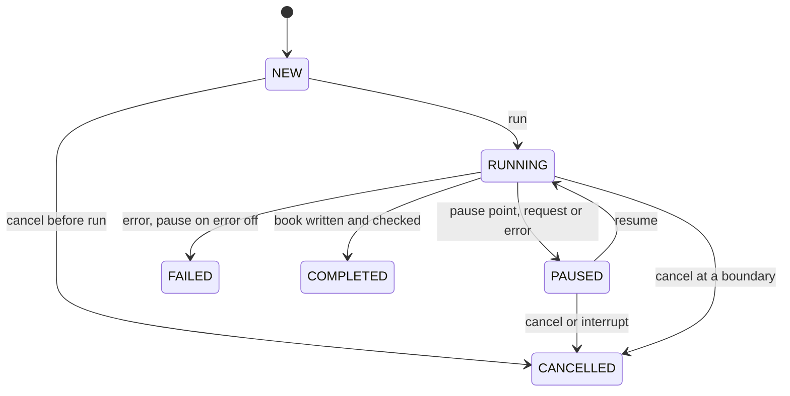

## Context

- `:llm` and `:pipeline` hold only empty Guice modules. `DocumentPort` has `open`, `write` and `unmask`, and no way to
  release a book (`docs/implementation_plan/CHANGE_BACKLOG.md#decision-debt`, D3). The registries' base class already
  has `close(String)`, which nothing can reach.
- **Decisions already made:**
  - ADR-0005: models sit behind a provider port with two clients.
  - ADR-0012: each project binds its own provider and models.
  - ADR-0007: the pipeline is automatic-first.
  - **ADR-0033** records this change's two contract decisions: the engine gets a bound chat model, and a translation
    runs as a pausable job. The sections below cite it instead of re-arguing it.
- **Writers:** `EpubWriter` and `Fb2Writer` change the opened tree in place; `MarkdownWriter` and `TxtWriter` splice
  into a copy of the original bytes. All four write back only segments whose `targetInner` is set.
- **Unmask:** `unmask` needs only the format and the segment, not the opened book (`DocumentService.unmask`).
- **Stable identities:** segment ids (`<unit id>:<order>`) and anchors are identical every time the same file is opened
  (`AllFormatsDeterminismTest`). `Document.id` is a fresh UUID on every open, so opening a file twice never collides in
  a registry. `Document.contentHash` is the SHA-256 of the file's bytes, or of the unzipped member for `.fb2.zip`.
- **Sections:** a section is a `Unit`. There is one per EPUB spine document, one per FB2 `<body>`, and exactly one for
  a Markdown or TXT file.
- **Module edges:** `:pipeline` already `requires` `:document` and `:llm`. What keeps the engine on contracts is JPMS
  exports (`:document` exports only `ua.bookloom.document`) and the ArchUnit rule `ports-not-concretes`, which flags a
  cross-module class only when its name ends in `Impl`, `Dao` or `Service`.
- **Logging today:** `LoggingBootstrap.configure` fixes the root level at INFO and its pattern carries no MDC, so no
  DEBUG or TRACE line can reach the log. The code base has one INFO call and no DEBUG or TRACE call.

## Goals / Non-Goals

**Goals:**

- Contracts the translation screen and the real LLM clients can use unchanged.
- A pause model a background task can drive.
- A command line that runs the same job.
- A log detailed enough to follow any segment from its prompt to its decision.

**Non-Goals:**

- Model side: real LLM clients, provider settings, model discovery, verification, the inference gate, retries, token
  usage.
- Pipeline: chunking, context, QA, judge.
- Persistence and resume after a restart.
- UI screens, and a folder mode.
- Commands on a paused job: editing or retrying a segment, and changing the temperature. They will attach to the
  paused job (D1, D3).
- Logging inside `:document`'s readers, writers and maskers. This change logs `:document` at `DocumentService` only.

## Decisions

Packages and modules follow `docs/implementation_plan/01_MODULE_INVENTORY.md`: `#module-api`, `#module-document`,
`#module-llm`, `#module-pipeline` and `#module-app`.

### D1: the chat model (ADR-0033)

```java
// :api ua.bookloom.api.llm (01_MODULE_INVENTORY.md#module-api)
interface ChatModel { Result<ChatResponse> chat(ChatRequest request); }
record ChatRequest(List<ChatMessage> messages) {}
record ChatMessage(ChatRole role, String content) {}               // ChatRole: SYSTEM, USER, ASSISTANT
record ChatResponse(String content, FinishReason finishReason) {}  // FinishReason: STOP, LENGTH, OTHER
interface ChatModelFactory { Result<ChatModel> create(ModelSelection selection); }
record ModelSelection(String providerId, String modelId) {}
```

- **Validation split.** Records reject a `null` component with `Objects.requireNonNull` and copy lists with
  `List.copyOf`. A blank model id or an unknown provider id is not an exception: `create` returns
  `ErrorCode.validation`. `ChatModel.chat` returns every failure as a `Result` and never throws.
- **Per-call hints, later.** A provider-neutral setting the engine chooses per call becomes a nullable `ChatRequest`
  component, left out of the wire request when null (FR-INFER-03). The first is a temperature, which a screen will let
  the user change while a job is paused; an output format follows. A compatibility constructor
  `ChatRequest(List<ChatMessage>)` keeps every call site compiling, and `ChatModel` does not change. A provider or model
  identity is never a hint.
- **The factory.** `ua.bookloom.llm.ChatModelFactoryImpl`, bound in `LlmModule`, checks the provider id `pseudo`
  directly and returns a `PseudoChatModel`. Any other provider id, or a blank model id, is `ErrorCode.validation`. A
  registry keyed by provider kind arrives with the first real client.
- **Where the pseudo model lives.** `PseudoChatModel` is in `ua.bookloom.llm.pseudo`, which the module neither exports
  nor opens. JPMS then stops `:pipeline` from naming it, which `ports-not-concretes` cannot do for a class without an
  `Impl` suffix.

The idea comes from the owner's go_text app, taken as ideas rather than a contract:

| go_text | Here | Added later, behind the same seam |
|---|---|---|
| `Provider.Chat(ctx, ChatRequest{Model, System, Messages, Temperature, MaxTokens, NumCtx})`; nil pointer fields are left out of the JSON | `ChatModel.chat(ChatRequest(messages))`; the model is bound when it is created | Ollama-native and OpenAI-compatible clients (ADR-0005) implementing `ChatModel`; per-call hints as nullable `ChatRequest` components |
| `LLMService` re-reads the current provider and settings, and passes the model name, on every call | the caller resolves the provider and model once, and the job keeps one bound `ChatModel` for its whole run | provider configs (kind, base URL, auth, credential reference) resolved from settings into a `ModelSelection` |
| `ChatResponse{Content, FinishReason, Usage, Duration}`, with the finish reason a raw string nothing checks | `ChatResponse(content, finishReason)` with `STOP`, `LENGTH` or `OTHER`; a `LENGTH` finish flags the segment | token usage, once progress shows throughput |
| `ProviderFactory.Register(kind, builder, profile)` and `Build(config)`; an unknown kind is a validation error | `ChatModelFactory.create(ModelSelection(providerId, modelId))`, checking `pseudo` directly | a registry keyed by provider kind, with per-kind profiles |
| `<think>` blocks removed in the provider and again in the service | none: the pseudo model returns clean text | sanitising (`<think>`, code fences, stray prose), the structured-output downgrade and the tolerant parse, inside `:llm` (`04_LLM_INTEGRATION.md#response-handling`) |
| typed errors mapped from HTTP status and transport, context overflow read from a 400 body, retries with a fresh timeout and `Retry-After`, a `TryAcquire` gate answering `Busy` | the engine branches on `ErrorCode` only | the HTTP → `ErrorCode` mapping, context-window detection, `InferenceGate` and service-owned retry, all inside `:llm` (ADR-0008); the engine does not change |
| `ListModels`, and three-stage verification on the draft config | none | inside `:llm` |

### D2: the translation job (ADR-0033)

```java
// :api ua.bookloom.api.pipeline (01_MODULE_INVENTORY.md#module-api)
interface TranslationEngine { Result<TranslationJob> newJob(TranslationRequest request, ChatModel model); }
record TranslationRequest(Path source, Path destination, String targetLanguage,
        @Nullable String sourceLanguage, boolean overwrite) {}
interface TranslationJob {
    Result<JobReport> run();                 // synchronous, on the caller's thread
    void pause(); void resume(); void cancel();
    void pauseAt(Set<PausePoint> points);    // AFTER_SEGMENT, AFTER_SECTION, BETWEEN_STAGES, ON_ERROR
    JobState state();                        // NEW, RUNNING, PAUSED, COMPLETED, CANCELLED, FAILED
    Subscription subscribe(JobListener listener);
}
```

**Events and report types**

- Sealed `JobEvent`: `StageStarted(stage, progress)`, `SegmentDecided(segmentId, status, reason, progress)`,
  `Paused(reason, error, progress)`, `Resumed(progress)` and `Finished(report)`.
- `JobProgress(stage, section, sections, accepted, flagged, pending)`, where `JobStage` is `TRANSLATE` or `EXPORT`.
- `JobReport(format, end, segments, accepted, flagged, flaggedSegments, written, error)`:
  - `end` is always a terminal state;
  - `written` is set only for COMPLETED;
  - `error` is set only for FAILED.
- `PauseReason` is the pause points plus `REQUESTED`.

**Checks**

- `newJob` checks the request in memory and returns `ErrorCode.validation` when:
  - the target language, or a given source language, does not match `^[A-Za-z]{2,3}(-[A-Za-z0-9]{2,8})*$`;
  - `BookFormat.ofFileName` finds no format for the source, or a different one for the destination;
  - the destination is the source: `Files.isSameFile` when the destination exists, otherwise equal normalized absolute
    paths.
- `run()` refuses before any model call when the destination exists and overwrite is off, when the source does not
  open, or when the job has already run.

**Document-side changes**

- `DocumentPort` gains `close(Document)`, returning `Result<Boolean>`.
- `BookFormat` gains its file suffixes, longest first (`.fb2.zip` before `.fb2`), `ofFileName(String)` returning
  `Optional<BookFormat>`, and `matchedSuffix(String)`. The matched suffix keeps the file name's own letter case, and
  the CLI uses it to build `<name>.<to><suffix>`. `FormatResolver`, the engine and the CLI all use these.
- Copy-with methods on the records: `Segment.withDecision(SegmentStatus status, @Nullable String targetInner)`,
  `Unit.withSegments(List<Segment>)` and `Document.withUnits(List<Unit>)`, so `:pipeline` never rebuilds a
  fourteen-component `Segment` itself.

**Implementation:** `:pipeline` (`01_MODULE_INVENTORY.md#module-pipeline`) implements the job in `ua.bookloom.pipeline`: the public
`TranslationEngineImpl`, bound in `PipelineModule`, and the package-private `TranslationJobImpl`, `SegmentTranslator`
and `BookExporter`. That is the only package the module opens to Guice.

### D3: boundaries, waiting and events (ADR-0033)



- **Boundaries** fall before each model call and before export.
  - Inside export, the only pause is on error, and cancellation is checked once more before the move.
  - A pause requested during export is ignored.
- **Before `run()`.** A `pause()` is kept and takes effect at the first boundary. A `cancel()` makes `run()` return a
  Cancelled report at once, without opening the book.
- **Waiting.** `TranslationJobImpl` guards its state with a `ReentrantLock` and a `Condition`; there is no
  `synchronized`.
  - It sets PAUSED before it sends `Paused`, then waits in `while (paused && !cancelRequested) await()`.
  - Control methods never wait for the job, so a subscriber may call `resume()` or `cancel()` inside its callback.
  - An `InterruptedException` while waiting counts as cancel.
  - Calling `resume()` while the job is running clears a pending pause request.
- **Events** are sent on the job's thread, outside the lock. A subscriber that throws is logged once and removed.
- **Size.** Checkstyle allows 400 lines per file, 30 per method and nesting depth 3, so the wait and the subscriber
  list may become package-private helpers.
- **Later commands.** Changing the temperature while paused will be a `TranslationJob` default method that sets the
  hint the next `ChatRequest` carries (D1). Editing or retrying a segment will attach to the paused job the same way.

### D4: reply decisions (`SegmentTranslator`)

Rows are checked from top to bottom, and the first that applies decides.

| Reply | Decision |
|---|---|
| Error `validation`, `emptyCompletion` or `contextWindow` | FLAGGED with that error |
| Error `cancelled` | The job becomes CANCELLED. |
| Any other error, or a thrown exception (as `internal`) | The job pauses if ON_ERROR is enabled, otherwise it becomes FAILED. The segment stays PENDING. |
| Text that is empty after trimming, whatever the finish | FLAGGED with `emptyCompletion` |
| Finish LENGTH or OTHER | FLAGGED with `validation` |
| Text with finish STOP | Trim it, put back the leading and trailing whitespace of `segment.masked()`, then `unmask`. The segment becomes ACCEPTED, or FLAGGED if `unmask` returns `validation`. Any other `unmask` error is handled like a model error. |

### D5: every export attempt opens the source again (`BookExporter`)

The job reads the source's segments and releases the source at once. Each export attempt then:

1. opens the source and compares its `contentHash` with the one read at the start;
2. copies each decided segment's status and translation onto it by segment id, with `Segment.withDecision`,
   `Unit.withSegments` and `Document.withUnits`;
3. writes `.<destination file name>` in the destination folder, which keeps the suffix `FormatResolver` needs;
4. opens that file and compares its segment count with the source's;
5. releases both books;
6. moves the file (`11_APP_ENVIRONMENT_AND_PATHS.md#lock-and-atomic`):
   - with overwrite off, `Files.move(tmp, dst)`, which fails when the destination exists;
   - with overwrite on, `Files.move(tmp, dst, ATOMIC_MOVE, REPLACE_EXISTING)`, retried as
     `Files.move(tmp, dst, REPLACE_EXISTING)` when the file system throws `AtomicMoveNotSupportedException`.

Any failure deletes the temporary file.

**Why:** writers change the opened tree, so writing the same opened book twice, as a retried export would, can put text
in the wrong place.

**Not `Files.createTempFile`:** its owner-only permissions would survive the move.

**Fixed-name collision guard:** before opening, writing or deleting the fixed temporary path, export rejects it with
`ErrorCode.validation` when its absolute path equals the source or destination, when existing entries refer to the same
file, when filesystem resolution shows an absent prospective temporary file would name the same endpoint, or when a
symbolic link occupies the temporary entry. Alias comparison follows existing symbolic-link chains and canonicalizes
an existing parent before comparing an absent leaf; filesystem link and `..` semantics are applied in resolution
order. The symbolic-link refusal deliberately includes dangling links: following a link from
`.<destination file name>` could otherwise create or overwrite the source or destination before validation. Missing
paths and link cycles that cannot resolve to the temporary path are left for the normal write or move error path. The
guard leaves the source, destination and colliding path untouched.

### D6: `close` per format (`01_MODULE_INVENTORY.md#module-document`)

Each reader gains `close(String documentId)`, which calls its registry's existing `OpenDocumentRegistry.close` and
reports whether an entry was removed. `DocumentService.close` switches on `document.format()` inside the same boundary
`try/catch` as `open`, `write` and `unmask`. The service cannot reach the registries itself: they are injected into
the readers, and `OpenEpubRegistry` is package-private.

### D7: command line (`01_MODULE_INVENTORY.md#module-app`)

- **`ua.bookloom.app.CoreModules`** lists the Guice modules the desktop app and the command line share:
  `AppModule(StartupContext)`, `DocumentModule`, `LlmModule`, `PersistenceModule` and `PipelineModule`.
  `BookLoomApplication.init` builds its injector from them plus `UiModule`.
- **`ua.bookloom.app.bootstrap.TranslateLauncher`** repeats the pre-injector steps of `Launcher`:
  1. resolves the paths with `AppPathsResolver`, and the environment with `AppEnvironment`;
  2. takes the single-instance lock with `SingleInstanceLock.acquire`. When the lock is held (`ErrorCode.busy`), it
     prints the error's title and message and exits with 1, and shows no `StartupFailureDialog`. `Launcher` exits with
     0 there, because a second window is a refusal; a script needs to know that nothing was written;
  3. configures logging at the resolved level (D8), without a console appender, so the console shows only the report;
  4. builds the injector from `CoreModules` and runs `AppLifecycle.phaseOne` and `phaseTwo`;
  5. runs `TranslateCommand` and exits with its code.

  `main` calls `run(List<String> args, Function<String, @Nullable String> getEnv, Function<String, @Nullable String>
  getProperty, PrintStream out)`, which tests call with a temporary `BOOKLOOM_DATA_DIR` and a held lock. Being on the
  bootstrap path, the class declares no static logger (`bootstrap-no-static-logger`).
- **`ua.bookloom.app.cli.TranslateCommand.run(List<String> args, PrintStream out)`** returns 0, 1 or 2.
  - Guice builds it (`@RequiredArgsConstructor(onConstructor_ = {@Inject})`) with `TranslationEngine` and
    `ChatModelFactory`. `module-info` opens `ua.bookloom.app.cli` to `com.google.guice` and does not export it.
  - It gets its model with `ModelSelection("pseudo", "uppercase")`.
  - Checkstyle bans only `LoggerFactory.getLogger(`, and nothing bans `System.out`. The report is the command's output,
    not logging.
- **Gradle `translate`** is a `JavaExec` task set up like `run` (`mainClass`, `classpath`, `javaLauncher`), with
  `workingDir = rootDir`, so relative paths resolve from the repository root.
  - Gradle fails the task on any non-zero exit code. The exit codes are therefore tested on `TranslateCommand` and
    `TranslateLauncher`.
  - The docs use `./gradlew -q :app:translate`.

### D8: logging — diagnostics are a requirement

The log is how a wrong book gets explained, so every class this change adds or touches logs at these levels. A task is
not done while its code lacks them (`.claude/rules/logging.md`).

| Level | What is written |
|---|---|
| ERROR | An unexpected fault, a thrown exception wrapped as `internal`: once, where it is wrapped, with the cause as the last argument. |
| WARN | A FLAGGED segment (id, code, expected and observed tokens); a job ending Failed (its code, without the cause, which was logged where the error was built); a pause on error; a subscriber that threw; a changed source; a segment-count mismatch; an atomic-move fallback; a refused request; a rejected command-line argument. |
| INFO | Lifecycle: logging configured (the level and where it came from); a command's arguments and exit code; a job's start (format, source, destination, languages, pause points, segment and section counts) and end (end state, counts, written file). |
| DEBUG | Every public method's entry with its parameters as ids, paths, languages, sizes and flags, and every branch taken: request checks, reply kind, gate result, boundary checks, pause-point hits, state transitions, waits, events sent, export steps, the factory's result and the close result. |
| TRACE | Values: the system and user messages, the raw reply, the trimmed and restored text, `unmask` input and output, and the pseudo model's input and output. **Book text appears at this level only.** |

- **Never logged,** at any level: a secret, a credential or an `Authorization` header. None exists yet; the rule stands
  for the real clients.
- **Mechanics:** `@Slf4j` on every class that logs, and parameterized messages. `if (log.isTraceEnabled())` goes around
  any argument that costs something to build, such as joined messages, and a private log helper is extracted wherever
  the lines would push a method past 30 lines.
- **Correlation:** `TranslationJobImpl.run()` puts `job` (the job id) into the MDC, and `segment` while a segment is
  decided; both are removed in `finally`. The log pattern gains `%X{job}`.
- **Once per failure:** the code that builds an `AppError` logs it. The job logs its own decision at DEBUG, without the
  cause.
- **Level switch** (`translation-pipeline` "Choose the log level for a run"): a pure resolver in
  `ua.bookloom.app.bootstrap`, over injected `getEnv` and `getProperty` like `AppEnvironment.resolve`, reads
  `BOOKLOOM_LOG_LEVEL`, then `bookloom.log.level`, then the default: `INFO` for `PROD` and `DEBUG` for `DEV`.
  `LoggingBootstrap.configure` sets that level on the `ua.bookloom` loggers and `WARN` on the root. After configuring,
  it writes one INFO line naming the level and its source, and one WARN line for a rejected value. Only
  `LoggingBootstrap` touches Logback types.
- **Dependencies:** `:llm` and `:pipeline` add `implementation(libs.slf4j.api)` and `requires org.slf4j`.
- **Test logs:** `:document`, `:llm` and `:pipeline` add `testRuntimeOnly(libs.logback.classic)` and
  `src/test/resources/logback-test.xml`. It writes `build/test-logs/test.log` with the same pattern, the `ua.bookloom`
  loggers at `${BOOKLOOM_LOG_LEVEL:-DEBUG}` and every other logger at WARN. A test's lines are read with
  `BOOKLOOM_LOG_LEVEL=TRACE ./gradlew :<module>:test --tests '<class>' --rerun`.
- **Offline:** no component opens a network connection, and `no-http-in-core-except-llm` is unchanged.

## Risks / Trade-offs

- **Coarse sections outside EPUB.** An FB2 section is a whole body, and a Markdown or TXT book is one section.
  → Finer sections are a `:document` change, made when a screen needs them.
- **Charset limits remain (backlog D1).** Text that a legacy source charset cannot hold still fails or degrades on
  export, and even upper-casing can leave a charset: `µ` becomes `Μ` and `ÿ` becomes `Ÿ`, and ISO-8859-1 holds
  neither, so such a TXT book is refused. → Owned by `settle-writer-policy-and-document-lifetime`.
- **Cancel waits for the model call in progress.** → The pseudo model answers instantly; real clients bound the wait
  with their request timeout.
- **A killed process can leave `.<destination file name>` behind.** → The next export to the same destination
  overwrites it.
- **A paused job holds its thread.** → Only one job runs at a time (ADR-0033).
- **TRACE logs of a whole book are large.** → TRACE is off by default, and the rolling appender caps each file at
  10 MB and all files at 200 MB.
